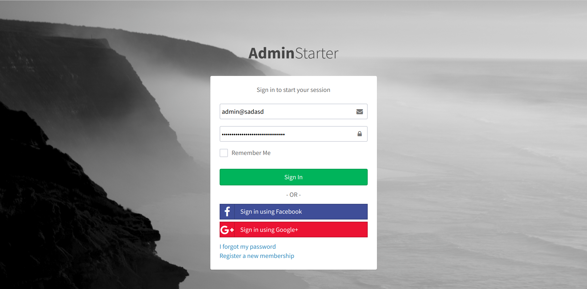
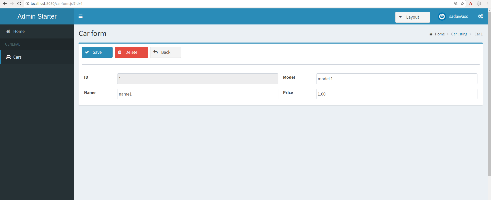

= AdminFaces Starter project

A simple project to get you started with https://github.com/adminfaces[AdminFaces^].

.Login page

.Car list
image:starter2.png[link="https://raw.githubusercontent.com/adminfaces/admin-starter/master/starter2.png"]

.Car form

.Car form responsive
image:starter4.png[link="https://raw.githubusercontent.com/adminfaces/admin-starter/master/starter4.png"]

== Running

It should run in any JavaEE 6 or greater application server.

You can also run via http://wildfly-swarm.io/[wildfly-swarm^] with command `mvn wildfly-swarm:run -Pswarm`.

Or using docker:

----
docker run -it -p 8080:8080 ${artifactId}/${artifactId}
----

TIP: Use the `build-and-run.sh` to easily start the application on a docker container.

The application is available at http://localhost:8080/${artifactId}

== Demo

A live demo is available on http://adminfaces.github.io/admin-starter/[Openshift here^]